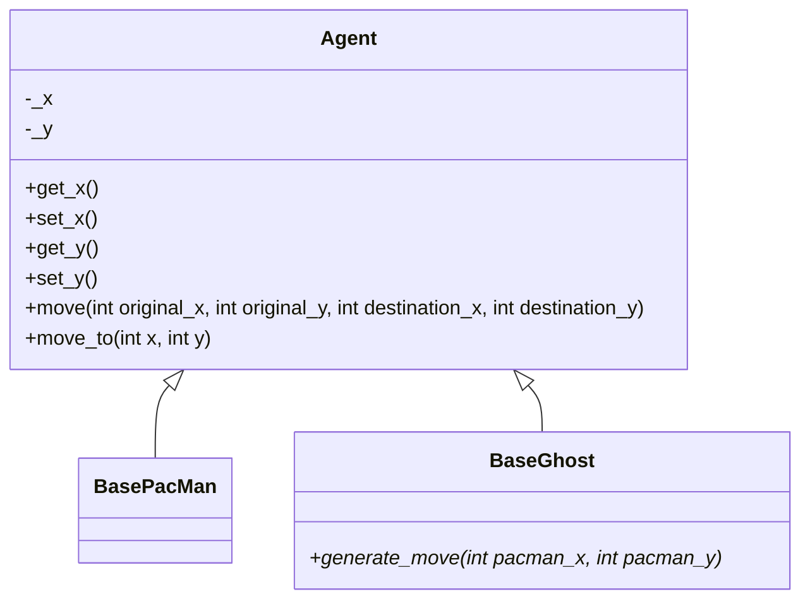
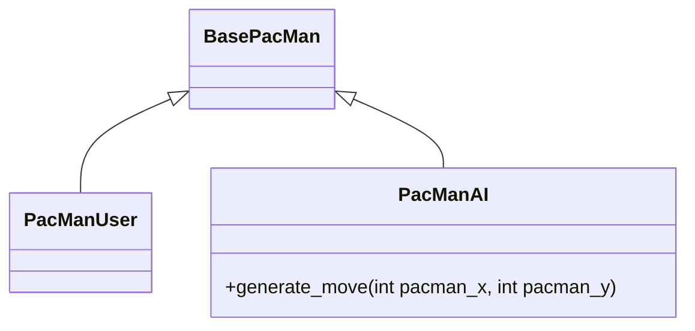
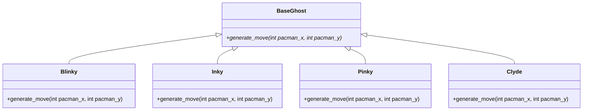
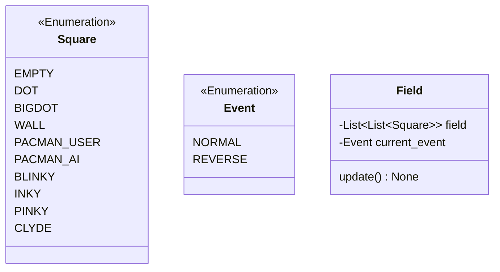
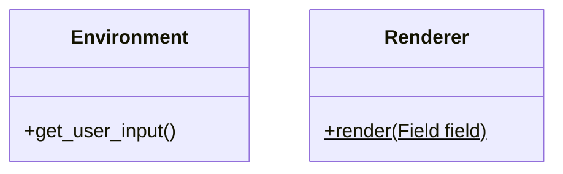

# Class Dependency

## Agent

```mermaid
classDiagram

    class Agent {
        -_x
        -_y

        +get_x()
        +set_x()
        +get_y()
        +set_y()
        
        +move(int original_x, int original_y, int destination_x, int destination_y)
        +move_to(int x, int y)
    }

    class BasePacMan {

    }
    class BaseGhost {
        +generate_move(int pacman_x, int pacman_y)*
    }

    Agent <|-- BasePacMan
    Agent <|-- BaseGhost

```

## PacMan

```mermaid
classDiagram

    class BasePacMan {

    }
    class PacManUser {

    }
    class PacManAI {
        +generate_move(int pacman_x, int pacman_y)
    }

    BasePacMan <|-- PacManUser
    BasePacMan <|-- PacManAI
```

## Ghost

```mermaid
classDiagram

    class BaseGhost {
        +generate_move(int pacman_x, int pacman_y)*
    }

    class Blinky {
        +generate_move(int pacman_x, int pacman_y)
    }
    class Inky {
        +generate_move(int pacman_x, int pacman_y)
    }
    class Pinky {
        +generate_move(int pacman_x, int pacman_y)
    }
    class Clyde {
        +generate_move(int pacman_x, int pacman_y)
    }
    
    
    BaseGhost <|-- Blinky
    BaseGhost <|-- Inky
    BaseGhost <|-- Pinky
    BaseGhost <|-- Clyde

```

## Field

```mermaid
classDiagram
    
    
    class Square {
        EMPTY
        DOT
        BIGDOT
        WALL
        PACMAN_USER
        PACMAN_AI
        BLINKY
        INKY
        PINKY
        CLYDE
    }
    <<Enumeration>> Square
    
    class Event {
        NORMAL
        REVERSE
    }
    <<Enumeration>> Event

    class Field {

        -List~List~Square~~ field
        -Event current_event
    
        update() None
    }

```

## UI

```mermaid
classDiagram
    class Environment {
        
        +get_user_input()
    }
    class Renderer {
        +render(Field field)$
    }

```