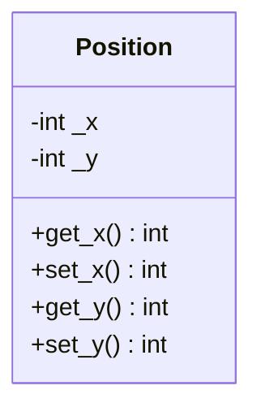
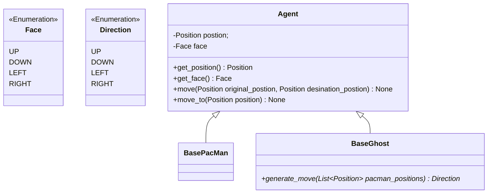
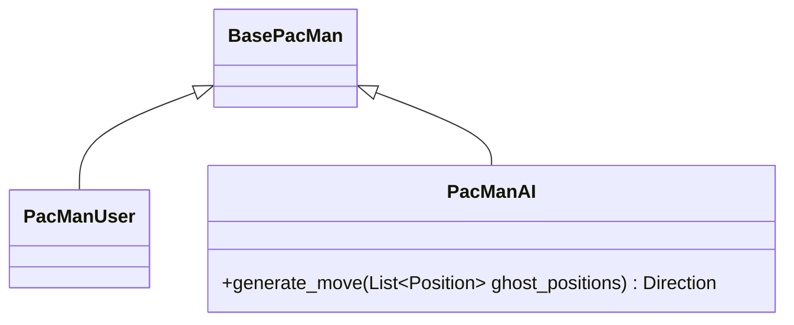
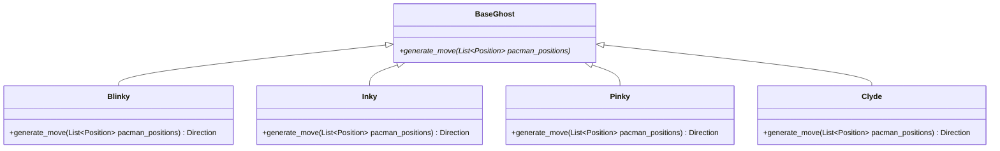
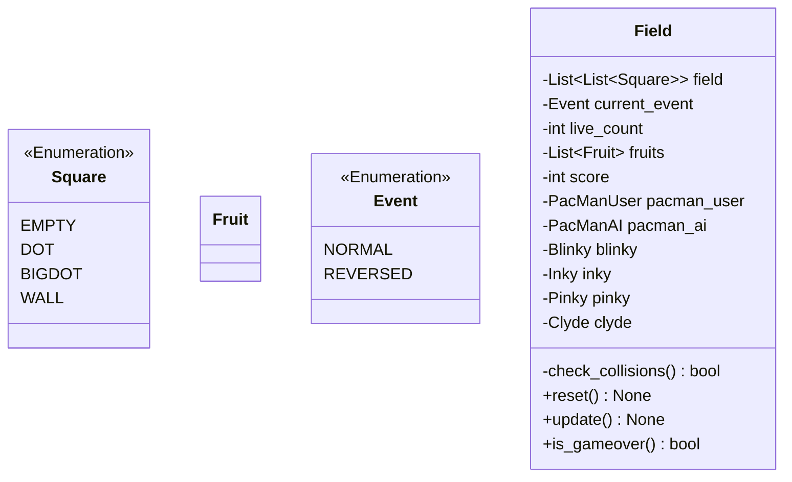

# Game Core Structure

## Utility

```mermaid
classDiagram
    class Position {
        -int _x
        -int _y

        +get_x() int
        +set_x() int
        +get_y() int
        +set_y() int
    }
```

## Agent

```mermaid
classDiagram

    class Face {
        UP
        DOWN
        LEFT
        RIGHT
    }
    <<Enumeration>> Face

    class Direction {
        UP
        DOWN
        LEFT
        RIGHT
    }
    <<Enumeration>> Direction

    class Agent {
        -Position postion;
        -Face face
        
        +get_position() Position
        +get_face() Face

        +move(Position original_postion, Position desination_postion) None
        +move_to(Position position) None
    }

    class BasePacMan {

    }
    class BaseGhost {
        +generate_move(List~Position~ pacman_positions)* Direction
    }

    Agent <|-- BasePacMan
    Agent <|-- BaseGhost

```

## PacMan

```mermaid
classDiagram

    class BasePacMan {

    }
    class PacManUser {

    }
    class PacManAI {
        +generate_move(List~Position~ ghost_positions) Direction
    }

    BasePacMan <|-- PacManUser
    BasePacMan <|-- PacManAI
```

## Ghost

```mermaid
classDiagram

    class BaseGhost {
        +generate_move(List~Position~ pacman_positions)*
    }

    class Blinky {
        +generate_move(List~Position~ pacman_positions) Direction
    }
    class Inky {
        +generate_move(List~Position~ pacman_positions) Direction
    }
    class Pinky {
        +generate_move(List~Position~ pacman_positions) Direction
    }
    class Clyde {
        +generate_move(List~Position~ pacman_positions) Direction
    }
    
    BaseGhost <|-- Blinky
    BaseGhost <|-- Inky
    BaseGhost <|-- Pinky
    BaseGhost <|-- Clyde

```

## Field

```mermaid
classDiagram
    
    
    class Square {
        EMPTY
        DOT
        BIGDOT
        WALL
    }
    class Fruit {

    }
    <<Enumeration>> Square
    
    class Event {
        NORMAL
        REVERSED
    }
    <<Enumeration>> Event

    class Field {

        -List~List~Square~~ field
        -Event current_event
        -int live_count
        -List~Fruit~ fruits
        -int score
        
        -PacManUser pacman_user
        -PacManAI pacman_ai
        -Blinky blinky
        -Inky inky
        -Pinky pinky
        -Clyde clyde


        -check_collisions() bool
        +reset() None
        +update() None
        +is_gameover() bool
    }

```
